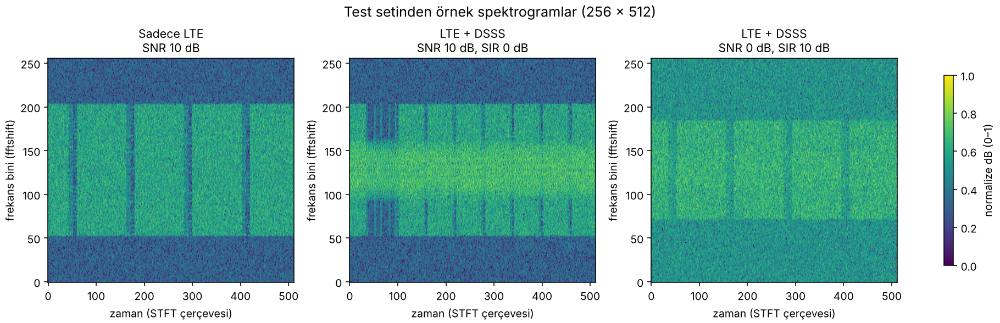
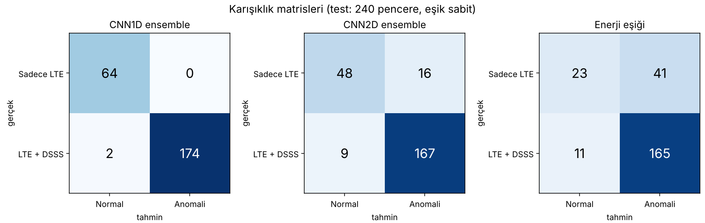

# RF Anomali Tespiti: LTE altında gizlenmiş DSSS yayını

> **Özet:** LTE sinyalinin altına gizlenmiş zayıf bir DSSS yayınını ham IQ (1D CNN) ve spektrogram (2D CNN) girdileriyle tespit ediyoruz. Kayıt bazlı bölme, validation'da seçilen eşik ve 3 seed ile ölçülen test sonucu: **1D CNN %97.5 ± 2.9 doğruluk (3 seed ensemble %99.2)**, klasik enerji eşiği %78.3. Hatalar zor koşullarda toplanıyor (SNR 0 dB, SIR 10 dB). Veri sentetiktir ve test seti küçüktür (60 kayıt): sonuçlar kontrollü bir deneydir, gerçek dünya başarısı iddiası değildir.



*Sağdaki örnek (SNR 0 dB, SIR 10 dB) DSSS'in en zayıf olduğu zor durumdur: gözle bile ayırt etmek güçtür.*

ICARUS veri setiyle, ham IQ ve spektrogram girdili iki CNN'i klasik bir enerji eşiğiyle karşılaştırıyoruz.
Çekirdek soru: **ham IQ mu, DSP ile işlenmiş zaman-frekans temsili mi daha iyi?**

## Kurulum

```powershell
pip install torch numpy pandas scikit-learn scipy
```

## Klasör yapısı

```
dsp/        A + Mert: DSP ve SCF çalışması (dalı `dsp` ile aynı içerik, spektrogram .npy dosyaları hariç)
  src/dsp/    STFT, pipeline, build_ml_dataset, SCF, gap/band-ratio betikleri
  notebooks/  veri, IQ, FFT, STFT analizleri
  outputs/    grafikler, tablolar, datasets/ml_handoff (README, dataset_config.json, metadata.csv, dsp_findings.md)
ml/         B: modeller, eğitim, baseline, değerlendirme, ML verisi üretimi (preprocess.py)
  weights/    resmi model ağırlıkları (*_best.pt)
  results/    v2/ (seed başına), ensemble/, final_results.md, split_check.txt
dashboard/  C: Streamlit arayüzü (demo.py), data/ (görseller, sonuç dosyaları), scripts/ (veri hazırlama ve kontrol betikleri)
```

1632 spektrogram `.npy` dosyası (~856 MB) boyutu nedeniyle `main`'e konmadı; `dsp` dalında (`outputs/datasets/ml_handoff/spectrograms/`) durur. **`dsp` dalı silinmemelidir.**

Komutlar repo kökünden çalıştırılır (`python ml/train.py ...`). DSP betikleri varsayılan olarak `dsp/` klasörünü proje kökü sayar; ham veri yollarını ortam değişkenleriyle verin: `RF_IQ_DIR` (IQ dosyaları), `RF_META_DIR` (Metadata CSV'leri), isteğe bağlı `RF_PROJECT_ROOT`. Örnek: `RF_IQ_DIR=/veri/IQ RF_META_DIR=/veri/Metadata python dsp/src/dsp/build_ml_dataset.py`.

## Kim hangi dosyadan sorumlu

| Rol | Dosyalar | Teslim ettiği çıktı |
| --- | --- | --- |
| A, DSP | `dsp/src/dsp/`, `ml/preprocess.py` (ML verisi üretimi) | `X_iq.npy`, `X_spec.npy`, `file_id.npy` |
| B, Model | `ml/models.py`, `ml/train.py`, `ml/run_seeds.py`, `ml/baseline_energy.py` | `ml/results/*_metrics.json`, `ml/results/*_test_preds.csv`, `ml/results/comparison.md` |
| C, Veri + değerlendirme + arayüz | `ml/datasets.py`, `ml/evaluate.py`, `dashboard/demo.py` | `y.npy`, `splits.npz`, grafikler, demo |

Ortak yardımcılar (kimse düzenlemez, sorun varsa konuşulur): `ml/check_data.py`, `ml/make_fake_data.py`, `ml/smoke_test.py`.

## Veri sözleşmesi

Tüm dosyalar `data/` klasöründe durur (Git'e girmez, Drive'dan paylaşılır).

| Dosya | Şekil | Tip | İçerik | Kim üretir |
| --- | --- | --- | --- | --- |
| `X_iq.npy` | `(N, 2, L)` | float32 | I ve Q kanalları, her pencere bir örnek | A |
| `X_spec.npy` | `(N, 1, F, T)` | float32 | STFT genlik spektrogramı (dB), aynı pencerelerin aynı sırada | A |
| `file_id.npy` | `(N,)` | int | pencerenin geldiği kayıt dosyası | A |
| `y.npy` | `(N,)` | int | 0 = yalnız LTE, 1 = LTE + DSSS | C |
| `splits.npz` | `train_idx`, `val_idx`, `test_idx` | int | **dosya bazında** bölme | C |
| `sir_db.npy` | `(N,)` | float | opsiyonel, SIR'a göre analiz için (LTE-only için NaN) | A |

`L`, `F` ve `T` en az 16 olmalı. `X_iq` ile `X_spec` aynı N'ye ve aynı pencere sırasına sahip olmalı.

**Teslimden önce herkes çalıştırır:**

```powershell
python ml/check_data.py --dir data
```

Çıktı `[HATA]` içeriyorsa veri teslim edilmez. Araç NaN, yanlış şekil, çakışan bölmeler,
aynı dosyadan pencerelerin farklı setlere düşmesi (sızıntı) ve birebir kopya pencereleri yakalar.

## Çalıştırma sırası

```powershell
# 0. Gerçek veri gelmeden önce, kod hazır mı? (hepsi OK olmalı)
python ml/smoke_test.py

# 1. Gerçek veri geldiğinde
python ml/check_data.py --dir data

# 2. Klasik baseline (tablonun ilk satırı)
python ml/baseline_energy.py --x data/X_iq.npy --y data/y.npy --splits data/splits.npz

# 3. İki CNN, her biri 3 seed
python ml/run_seeds.py --model cnn1d --x data/X_iq.npy   --y data/y.npy --splits data/splits.npz
python ml/run_seeds.py --model cnn2d --x data/X_spec.npy --y data/y.npy --splits data/splits.npz

# 4. Sunum tablosu: results/comparison.md
python ml/run_seeds.py --table
```

Gerçek veride ilk iş **aşırı öğrenme testi**: model 32 örneği ezberleyemiyorsa mimaride veya veri hazırlığında hata vardır.

```powershell
python ml/train.py --model cnn1d --x data/X_iq.npy --y data/y.npy --splits data/splits.npz --subset 32 --epochs 80 --patience 1000 --tag overfit
```

`train_loss` sıfıra yaklaşmalı.

## Değişmez kurallar

1. **Bölme dosya bazında.** Aynı kayıt dosyasından çıkan pencereler tek sette kalır. `splits.npz` bir kez sabitlenir, hafta boyunca değişmez.
2. **Test setine bakılarak ayar yapılmaz.** Hiperparametre ve eşik seçimi yalnızca val setinde yapılır.
3. **Normalizasyon istatistiği yalnızca eğitim setinden** hesaplanır (`train.py` bunu yapar).
4. **Rastgelelik tohumu sabit.** Sonuçlar 3 seed'in ortalaması ± standart sapması olarak raporlanır.
5. **`make_fake_data.py` yalnızca kod sınamak içindir.** Sahte veriden çıkan rakamlar sunuma girmez.
6. **Çok yüksek doğruluk (%99+) görürseniz önce sızıntıyı arayın**, sonra sevinin: `check_data.py`'yi tekrar çalıştırın.

## Sonuçlar (donmuş split, test = 60 kayıt / 240 pencere, eşik 0.5)

| Model | Doğruluk | F1 | ROC-AUC | FP | FN |
| --- | --- | --- | --- | --- | --- |
| Enerji eşiği (baseline) | 0.783 | 0.864 | 0.757 | 41 | 11 |
| CNN2D, 3 seed ort. ± std | 0.886 ± 0.024 | 0.923 ± 0.013 | 0.961 ± 0.019 | 15.0 ± 11.5 | 12.3 ± 7.0 |
| CNN2D, 3 seed ensemble | 0.896 | 0.930 | 0.9655 | 16 | 9 |
| CNN1D, 3 seed ort. ± std | 0.975 ± 0.029 | 0.982 ± 0.021 | 0.9998 | 0.0 | 6.0 ± 7.0 |
| CNN1D, 3 seed ensemble | 0.992 | 0.994 | 0.9997 | 0 | 2 |



- Ensemble = üç seed'in `p_anomaly` ortalaması, eşik 0.5; test üzerinde seçim yapılmadı. Hesap: `python ml/make_final_tables.py`.
- Kayıt bazlı bootstrap %95 GA (ensemble doğruluk): CNN1D [0.975, 1.000], CNN2D [0.829, 0.954], baseline [0.683, 0.875].
- Hatalar: tüm yanlış alarmlar OnlyLTE + SNR 0 dB; tüm kaçırmalar LTE+DSSS + SIR 10 dB.
- Ayrıntılı tablolar: `ml/results/final_results.md`. Ham tahminler ve metrikler: `ml/results/v2/` (seed başına) ve `ml/results/ensemble/`.
- Resmi koşu `ml/results/v2`dir. Eski bölmeyle (1136/248/248) yapılan koşular kullanılmaz.

## Yeniden üretilebilirlik

- **Split:** `splits.npz` (train/val/test = 1144/248/240 pencere = 286/62/60 kayıt; MD5 `97454098d71feffae1eac57a6c3dfb11`). Dosya: `ml/splits.npz`; pencere bazında okunaklı hali: `ml/results/split.csv` (idx, kayıt, etiket, SNR, SIR, split). Kayıt kümelerinin kesişimi boş (`ml/results/split_check.txt`).
- **Hiperparametreler** (`ml/train.py` varsayılanları): Adam, lr 1e-3, batch 64, en çok 40 epoch, early stopping patience 6 (**validation loss**), eşik 0.5, sınıf ağırlıklı çapraz entropi; seed 1, 2, 3. En iyi epoch'lar (metrics.json): CNN1D 39/31/9, CNN2D 35/32/34.
- **Baseline eşiği** (1.2356) yalnızca **val** setinde F1'i en büyük yapan değerdir (`ml/baseline_energy.py`).
- **Model ağırlıkları:** `ml/weights/` (resmi koşu results_v2: cnn1d_s1–s3, cnn2d_s1–s3, ~1.8 MB). Yedek: Drive `rf-anomaly-data/results_v2/`.
- **Gecikme** yalnızca model çıkarımıdır (STFT hariç, Colab CPU, batch = 1; işlemci modeli kayıtlı değil).

## Veri ve atıf

Veri: ICARUS Synthetic (MATLAB_Dataset; OTA-Cellular modülünde gerçek ortamdan yakalanan LTE'ye sentetik DSSS eklenmiştir). Ham veri bu repoda **yoktur**; veri setinin sahibine ait lisans ve atıf koşullarını kullanmadan önce kontrol edin. Repoda yalnızca türetilmiş sonuçlar, split bilgisi ve model ağırlıkları bulunur.

## Dashboard

Sonuçları gösteren Streamlit arayüzü: `dashboard/demo.py` (görseller ve sonuç dosyaları `dashboard/data/`, veri hazırlama betikleri `dashboard/scripts/`). Repo kökünden:

```powershell
pip install -r dashboard/requirements.txt
streamlit run dashboard/demo.py
```

Gösterilen resmi sayılar `ml/results/` ile aynıdır. Baseline için iki çalıştırma vardır: resmi kayıt (eşik 1.2356, doğruluk 0.783) ve `dashboard/scripts/energy_baseline.py` ile bağımsız yeniden çalıştırma (eşik 1.2532, doğruluk 0.775); ROC-AUC her ikisinde 0.7568, fark yalnızca eşik aramasından gelir.

## Sunumda dürüstçe söylenecek sınırlar

- OTA-Cellular modülünde gerçek ortamdan yakalanan LTE'ye **sentetik DSSS eklenmiştir**.
- Veri sentetiktir ve test 60 kayıtla sınırlıdır; sonuçlar bu test setine aittir, genel bir güvenilirlik iddiası değildir.
- CNN2D seed'e duyarlıdır (FP 15 ± 11.5). SCF çalışması keşif niteliğindedir.
- Sistem yalnızca DSSS'i tanır; bilinmeyen sinyal türlerindeki davranış ölçülmemiştir (denetimsiz anomali tespiti sonraki aşama).

## Git akışı

```powershell
git checkout -b <dal-adi>     # dsp-onisleme | model-egitim | degerlendirme-demo
git add .
git commit -m "ne yaptiniz"
git push origin <dal-adi>
# GitHub'da Pull Request açıp main'e birleştirin; main'e doğrudan push yok.
git pull origin main          # günde birkaç kez
```

`data/`, `*.npy`, `*.pt`, `*.pth` `.gitignore`'dadır; yalnızca küçük, resmi ağırlıklar (`ml/weights/*.pt`) istisnadır.
